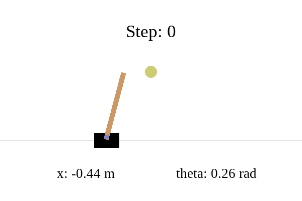

# Runtime-Learning-Machine

---

This repository contains the experiments of the **Runtime Learning Machine**, where the framework is validated upon
three different
physical systems in different environments. Respectively, they're:

* [Cart-Pole](./cartpole/README.md) in Openai Gym
* [Quadruped-A1](./quadruped-a1/README.md) in Real-world environment
* [Quadruped-Go2](./quadruped-go2/) in Nvidia IsaacGym

---

# Cart-Pole

---

Data-driven methods are prone to the unknown unknowns in the environment which brings safety challenges for the
safety-critical systems. Runtime Learning Machine is designed to address related concerns:

 
 
  <b>Fig. In unknown environment, DRL agent violates safety constraint (Left) while Runtime Learning Machine enables 
agent to safely learn (right)</b>

# Quadruped-A1

---

# Quadruped-Go2

---

A Sim-to-Sim policy transfer from Pybullet A1 robot to IsaacGym Go2 robot. With **Runtime Learning Machine**
architecture to address real-time safety concern from unknown environment.

  
  <b>Fig. Safety Performance of Runtime Learning Machine under Random Push</b>

# Citation