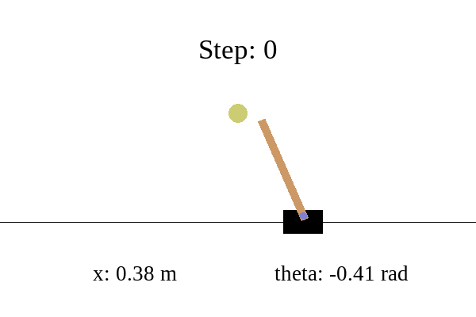
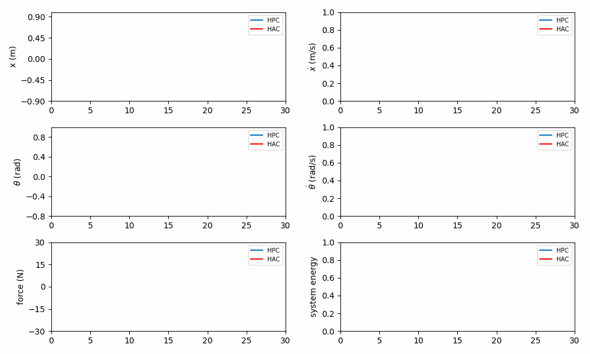
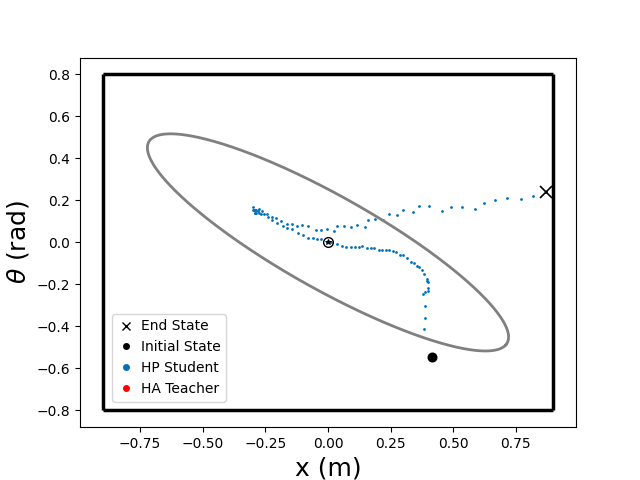
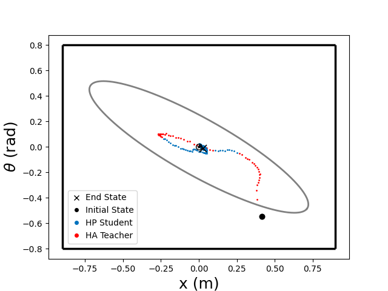

# RLM-Cartpole


---

This repository simulates the cart-pole system in Openai-Gym to validate the feasibility of the
**Runtime Learning Machine** for the
safety-critical applications. We use MATLAB to calculate solution of LMIs.

## Table of Content

* [Code Structure](#code-structure)
* [Environment Setup](#environment-setup)
* [Experiment](#pretrain-a-policy)
    * [Pretrain a Policy](#pretrain-a-policy)
    * [Continual Learning](#continual-learning)
    * [Results]()
* [Misc](#misc)

---

## Code Structure

In the codebase, [Hydra](https://hydra.cc/) is utilized for configuring hyperparameters in YAML style. The structure is
formatted as follows:

```
├── config                                <- Configure files for the framework
├── results   
│      ├── hydra                          <- Hydra log for each runtime
│      ├── logs                           <- Logs for training/testing/evaluation
│      ├── models                         <- Trained weights files
│      └── plots                          <- Plots for cartpole phase/trajectory
├── scripts                              
│      ├── test                           <- For testing
│      └── train                          <- For training
│           ├── pretrain.sh                   <- Pretain a policy using Phy-DRL
│           ├── rlm_safe_learn.sh             <- Continual learn with RLM
│           ├── rlm_assurance.sh              <- Continual learn with RLM (only with safety assurance)
│           └── unsafe_continual_learn.sh     <- Continual learn (no safety guarantee)
├── src                              
│    ├── envs                             <- Environment of the physical plant (cartpole)
│    ├── ha_teacher                  
│           ├── matlab                    <- m files for solving LMIs
│           ├── ha_teacher.py             <- High Assurance Teacher
│           └── mat_engine.py             <- Matlab engine interface
│    ├── hp_student                               
│           ├── agents                    <- Phy-DRL agent (High Performance Student)
│           ├── networks                  <- Phy-DRL network structure
│           └── ... 
│    ├── trainer                  
│           └── trainer.py                <- Training/Testing/Evaluation loop                               
│    ├── ... 
│    └── physical_design.py               <- Physical matrix design for cartpole     
├── main.py                               <- Main file
└── requirements.txt                      <- Depencencies for code environment                      
```

## Environment Setup

It is recommended to create a conda environment for development. The required packages have been tested under Python
3.9, though they should be compatible with other Python
versions.

### Python Package

Follow the steps below to build the Python environment:

1. First, download the appropriate version of [Anaconda](https://www.anaconda.com/download/success). After installation,
   create a virtual environment:
   ```bash
   conda create --name cartpole python==3.9.5
   ```
2. Second, activate the conda environment you created:
   ```bash
   conda activate cartpole
   ```
3. Finally, install all dependent packages by running:

   ```bash
   pip install -r requirements.txt
   ```

### Matlab Interface

The LMIs need MATLAB for computation. Please install [MATLAB](https://mathworks.com/downloads/) and check
the [requirements](https://www.mathworks.com/support/requirements/python-compatibility.html) to ensure your python
version is compatible with the installed matlab version. After that, build MATLAB Engine API for Python:

1. Find the folder under matlab root path:
   ```bash
   cd <matlab_root>\extern\engines\python
   ```

2. Use pip to install:
   ```bash
   python -m pip install .
   ```

## Experiment

### Pretrain a Policy

---

Use Phy-DRL to pretrain a policy in an environment with some domain randomization employed:

   ```bash
   bash scripts/train/pretrain.sh
   ```

You can observe the training status using tensorboard:

   ```bash
   tensorboard --logdir ./results/logs
   ```

To test the trained Phy-DRL policy, run command:

   ```bash
   bash scripts/test/pretrain.sh
   ```

The cartpole system will safely converge to the set point using control action from Phy-DRL agent:

<p align="center">
  
 
 <br><b>Fig 1. A Well-trained Agent Provides Safety and Stability</b>
</p>

### Unknown unknowns

---

**`Safety-critical system:`** We model the Cartpole as a safety-critical system by defining the `Safety Set` (Group of
all
admissible states). Any safety violation will be highlighted in red during the animation. Since data-driven methods are
inherently sensitive to environmental discrepancies, they cannot guarantee safety in the presence of unknown factors.

To simulate these unknown unknowns, we further introduce:

* *Increased cart friction*
* *Out-of-distribution* cases for DRL
* The *actuator noise*

Running script `scripts/test/pretrain_fric30.sh`, the Cartpole system will violate the safety constraints in the unknown
environment:

<p align="center">
  
  
 <br><b>Fig 2. System Failure due to Large Sim-to-Real Gap</b>
</p>

### Continual Learning

---

We must let agent continually learn in the unknown environment. Here we compare three learning strategies:

#### 1. Unsafe Continual Learning

Continual learning without any safety guarantee in the unknown environment:

   ```bash
   bash scripts/train/unsafe_continual_learn.sh 
  ```

#### 2. Runtime Learning Machine for safety assurance

In this mode, the **Runtime Learning Machine** enables continual learning in the unknown environment, but HA-Teacher
only provides safety assurance (The HP-Student doesn't learn from HA-Teacher):

   ```bash
   bash scripts/train/rlm_assurance.sh 
  ```

#### 3. Runtime Learning Machine for safe continual learning

In this model, the **Runtime Learning Machine** enables continual learning in the unknown environment, the HA-Teacher
provides safety guarantee and HP-Student learns from HA-Teacher:

   ```bash
   bash scripts/train/rlm_safe_learn.sh 
  ```

In Runtime-Learning-Machine, the teacher will always provide safety guarantee for the student (agent) during continual
learning:
<p align="center">
  
  
 <br><b>Fig 3. Teacher Guarantees Safety During Agent Learning (and Inference)</b>
</p>

Below are the two different system phase portraits during training. The polygon represents the `Safety Set` (*hard
constraints*), and the ellipse represents the `Safety Envelope`:
<p align="center">
 
  
 <br><b>Fig 4. Phase Behavior of Unsafe Learn (left) and Runtime Learning Machine (right)</b>
</p>

### Results

---

To show the agent's learning performance with **Runtime Learning Machine**, we continually train the HP-Student for the
same episodes, either with or without **Runtime Learning Machine**.

- #### Unsafe Continual Learning

In first 10 episodes, the system frequently failed, preventing the agent from gathering sufficient data to learn
a safe policy.
<p align="center">
  
  
 <br><b>Fig 5. Agent Random Exploration Causes System Failure</b>
</p>

- #### Runtime Learning Machine

By **Runtime Learning Machine**, the cartpole would always keep in a safe condition. To validate the training performance,
we disable the
teacher module during testing, and the result shows that the HP-Student has exhibited stable behavior:

<p align="center">
  
  
  <br><b>Fig 6. Agent Inference after training 10 episodes by Runtime Learning Machine</b>
</p>

## Misc

---

- To plot cartpole `phase/trajectory` or live show its `animation/trajectory`, check corresponding fields
  in `config/logger/logger.yaml`
- Choose between training by `steps` or `episodes`, set field `training_by_steps` to *true* or *false*
  in `config/base_config.yaml`
- The repository uses the `logging` package for debugging. Set debug mode in `config/base_config.yaml`
- In case you get issues during live plot, check the suitable
  backend [libraries](https://matplotlib.org/stable/users/explain/figure/backends.html) to use for matplotlib and set it
  by *matplotlib.use(xxx)* in `src/logger/live_plotter.py`