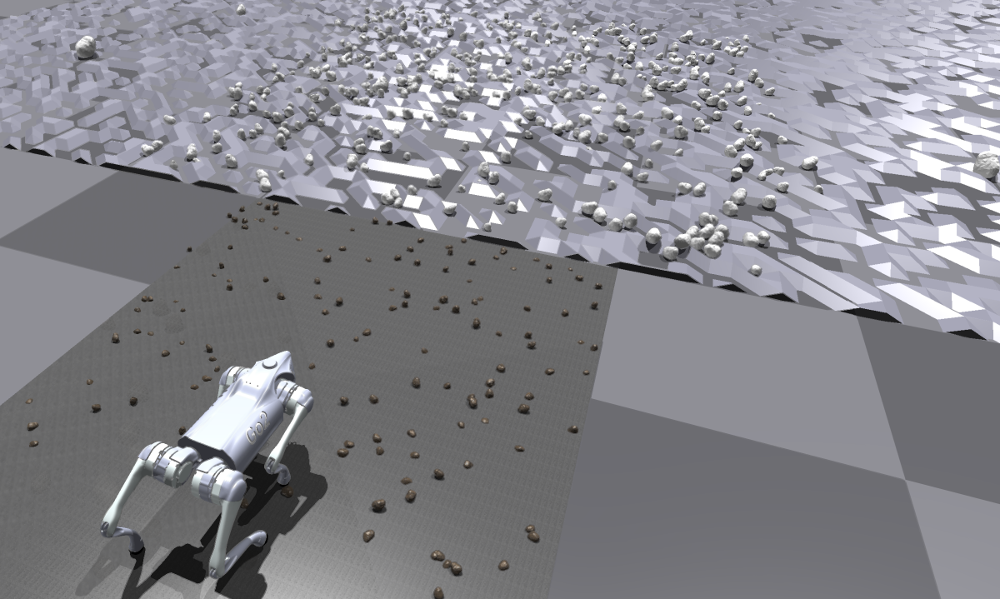

# RLM-Quadruped-Go2


---

This repo deploys the **Runtime Learning Machine** on Quadruped-Go2 robot to within a sim2sim environment (Pybullet to
IsaacGym)

## User Guide

### Dependencies

* *Python - 3.8 above*
* *PyTorch - 1.10.0*
* *Isaac Gym - Preview 4*

---

### Setup

1. Create the conda environment with:

```bash
conda env create -f environment.yml
```

2. Activate conda environment and Install `rsl_rl` lib:

```bash
conda activate phyrl-go2
cd extern/rsl_rl && pip install -e .
```

3. Download and install IsaacGym:

* Download [IsaacGym](https://developer.nvidia.com/isaac-gym) and extract the downloaded file to the root folder.
* navigate to the `isaacgym/python` folder and install it with commands:
  ```bash
  cd isaacgym/python && pip install -e .
  ```
* Test the given example (ignore the error about GPU not being utilized if any):
  ```bash
  cd examples && python 1080_balls_of_solitude.py
  ```

## Sim-to-Sim

---

We deploy a *sim-to-sim* policy (Phy-DRL) trained in the PyBullet environment on the A1 robot and transfer it to
IsaacGym for the Go2 robot.

<p align="center">
  
 <br><b>Fig 1. A Sim-to-Sim policy transfer in unforeseen Environment on Quadruped Go2</b>
</p>

- ### Phy-DRL

---

1. To evalidate trained **Phy-DRL** policy on quadruped Go2 robot, run following command:

```bash
python -m src.scripts.ddpg.eval --logdir=logs/train/ddpg_trot/demo --num_envs=1 --use_gpu=True
```

This experiment highlights the instability and safety issues of the pretrained policy in the unforeseen environment,
even
with the employment of domain randomization.

- ### Runtime Learning Machine

---

The **Runtime Learning Machine** is designed to ensure real-time responsiveness in safety-critical systems, effectively
handling unforeseen incidents arising from unknown environments.

- **Safety Assurance:**

1. To evalidate **Runtime Learning Machine** for Phy-DRL on quadruped Go2 robot with an OOD (Out-of-Distribution) data,
   run command:

```bash
python -m src.scripts.ddpg.eval --logdir=logs/train/ddpg_trot/demo --num_envs=1 --use_gpu=True --enable_ha_teacher=True
```

<p align="center">
  
 <br><b>Fig 2. Runtime Learning Machine on Quadruped Go2 in unforeseen Environment</b>
</p>

2. To validate the safety performance of **Runtime Learning Machine** under random push, run command:

```bash  
python -m src.scripts.ddpg.eval --logdir=logs/train/ddpg_trot/demo --num_envs=1 --use_gpu=True --enable_ha_teacher=True --enable_pusher=True
```

<p align="center">
  
 <br><b>Fig 3. Safety Performance of Runtime Learning Machine under Random Push</b>
</p>

- **Runtime Learning:**

The **Runtime Learning Machine** facilitates the rapid adaptation of the quadrupedal Go2 robot to unseen environments:

```bash
python -m src.scripts.ddpg.train --use_gpu=True --enable_ha_teacher=True
```

## Misc

---

- In order to plot the latest saved trajectory, run command `python -m src.utils.plot_trajectory`